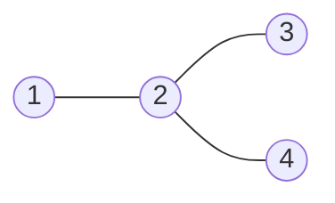
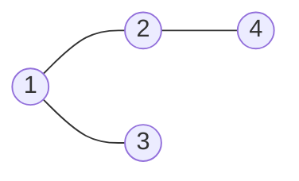
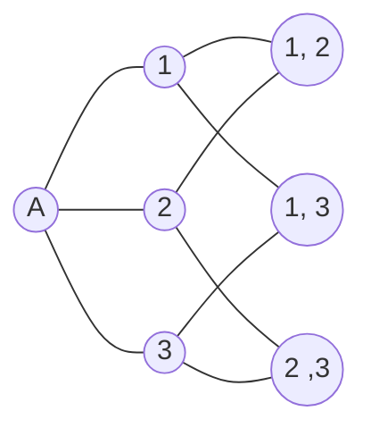
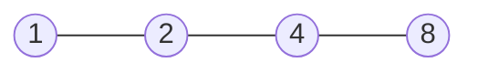

# Descrete Mathmetic: Week 1

## Examples
Example 1. 


>R = {(1, 1),  (2, 2), (3, 3),  (4, 4), (1, 2), (1,3), (1, 4), (2, 3), (2, 4), (3, 4)}

Example 2. 


>A = {1, 2, 3, 4}, R = x | y
>R = {(1, 1), (2, 2), (3, 3), (4, 4), (1, 2), (1, 3), (1, 4), (2, 4)}

Example 3.



> U = {1, 2, 3}, A = P(U) &rArr; A: { {1}, {2}, {3}, {1, 2}, {1, 3}, {2, 3}, {1, 2, 3}, {$\phi$} }
>
> subset relation R: { ({1}, {1, 2}) , ({1}, {1, 3}) , ({2}, {1, 2}) , ({2}, {2, 3}), ({3}, {1, 3}) , ({3}, {2, 3}) }
>
> > 1整除2，2整除4，1整除4，1整除3

Example 4.

hasse: 


## Definition

1. Reflexive (自反性):
	1. Definition: $\forall x \in A, (x, x)\in R ,u\geq I, u,I\space is\space4 \times 4$ 
	
	1. Matrix: $I$ is a *identity matrix(單位矩陣)*.
	
	1. Counter: $2^{n^2-n}$
	
	1. Graph: Loop
	
	   ```mermaid
	   graph TD
	   	A((x)) --> A
	   ```
	
2. Symmetric (對稱性):

   1. Definition: $if\space x \times y \in R $ $\implies $ $y \times x \in R$ $\forall x, y \in A$

   2. Matrix: $ m = m^{+r}$

   3. Counter: $2^{\frac{n^2+n}{2}}$

   4. Graph: If path(a, b) exist, &rArr; path(b, a) exist.

      

      ```mermaid
      graph LR
      A((x)) --> B((y)) --> A
      ```

      

3. Antisymmetric (反對稱性):

   1. Definition: $\forall a, b$, $a \times b \in R$, $b \times a \in R$,$\implies $ $a = b$

   2. Matrix: $m \bigcap m^{+r} \leq I_n$

   3. Counter: $2^n3^{\frac{n^2-n}{2}}$

   4. Graph: 只有單向箭頭

      ```mermaid
      graph LR
      	A((a)) --> B((b))
      ```

4. Transitive (傳遞性):

   1. Definition: $\forall a, b, c\in A, (a, b) \in R, (b, c) \in R$$\implies $(a, c) $\in$ R

   2. Matrix:$m^2 \leq m$

   3. Graph: If path(a, c) exist$\implies$edge(a, c) exist.

      ```mermaid
       graph LR
      	A((a)) --- B((b)) --- C((c)) ---A
      ```

      

