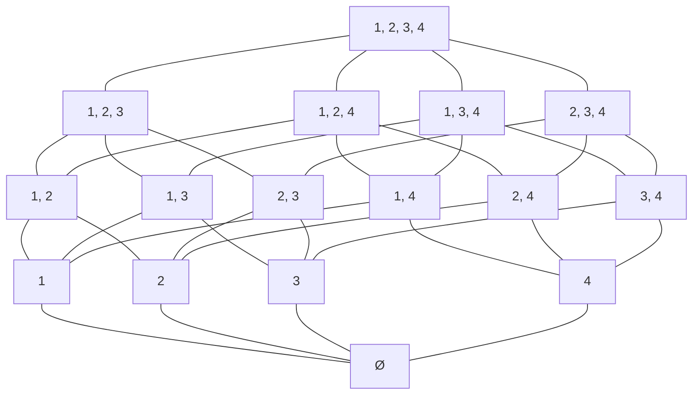

# Descete Mathmetic: Week 2

## Definition

#### 1. Partial-Order relation

> A relation **R** on set **A** is called *partial-orded* if **R** is *"reflexive, antisymmetric and transitive"*.

#### 2. Poset

> Poset is partial-order set.
>
> A set with partial order, and a poset can be visualized through its *Hasse diagram (哈斯圖)*

#### 3. GLB, LUB

##### GLB(Greatest Lower Bound)

> A poset $A$ on $R$  and non-empty subset of $A$, real number $x$, if $x \leq a, \forall a \in A$.

##### LUB(Least Upper Bound)

> A poset $A$ on $R$  and non-empty subset of $A$, real number $x$, if $a \leq x, \forall a \in A$.

### 4. Example

$u = {1, 2, 3, 4}$ , $A = P(u) = \{\{\phi\}, \{1\},\{2\},...\{1, 2, 3, 4\}\}$

$R = subset$ &rArr; $(A, R)$

$B = \{\{1\}, \{2\}, \{1, 2\}\}$ , $LUB$ of $B = \{1, 2\}$ , $GLB$ of $B = \{\phi\}$ , $LUB$ for $B$ in $(A, R)$ are $\{\phi\}$

&rArr; (A, R)  lattice:

### 5. Example

$R$ on $Z$ $xRy$, if $4|(x-y)$

$[0] = \{...,-8, -4, 0, 4, 8,...\} = \{4k | k \in Z\}$

$[1] = \{..., -7, -3, 1, 5, 9,...\} = \{4k+1 | k \in Z\}$

$[2] = \{...,-6, -2, 2, 6, 10,...\} = \{4k + 2 | k \in Z\}$

$[3] = \{..., -5, -1, 3, 7, 11,...\} = \{4k + 3 | K \in Z\}$

### 6. Equivalence Relation

> A relation **R** on set **A** is called *equivalence relation* if **R** is *"Reflexive, Symmetric, Transitive"*

### 7, Example

If **R** is an equivalence relation on a set **A**

​	$x, y \in A,\space x \in [x], xRy \space\space iff\space\space [x] = [y]\space\space or\space\space [x]\bigcap [y] = \phi$

​	$A = \{1, 2, 3, 4, 5\}$,  $R = \{(1, 1), (2, 2), (2, 3), (3, 2), (3, 3), (4, 4), (4, 5), (5, 4), (5, 5)\}$

1. 是否為Equivalence relation? 是

   Reflexive: $(1, 1), (2, 2), (3, 3), (4, 4), (5, 5)$ exist.

   Symmetric: $(2, 3), (3, 2), (4, 5), (5, 4)$ exist.

   Transitive: $(2, 3), (4, 5)$ exist.

2. Partition:  $[1] = \{1\}, [2] = \{2, 3\} = [3], [4] = \{4, 5\} = [5]$

### 8. Example

$A = \{1, 2 ,..., 7\} = \{1, 2\}\bigcup \{3\} \bigcup \{4, 5, 7\} \bigcup \{6\}$

$R \implies (\{1, 2\}\times \{1, 2\})\bigcup (\{3\}\times \{3\}) \bigcup (\{4, 5, 7\}\times \{4, 5, 7\})\bigcup (\{6\}\times \{6\})$

$R = \{(1, 1), (1, 2), (2, 1), (2, 2), (3, 3), (4, 4), (4, 5), (4, 7), (5, 4), (5, 5), (5, 7), (7, 4), (7, 5), (7, 7), (6, 6)\}$

$|R| = 2^2 + 1^2 + 3^2 + 1^2 = 15$

