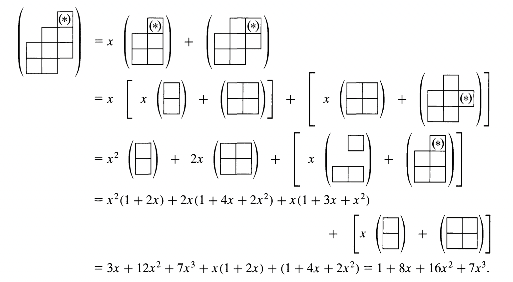

# Descrete Mathmetic Week 3

## Principle of Inclusion and Exclution (PIE, 排容原理)

1. Definition: $\overline{N} = N - \sum_{1\leq i\leq t}N_{c_i}+\sum_{1\leq i \leq j \leq t}N_{c_ic_j} - \sum_{1 \leq i\leq j \leq k \leq t}N_{c_ic_jc_k} + ...+(-1)^t N_{c_1c_2c_3...c_t}$

2. Proof:

   1. Case 1 satisfies none of $c_i$

   2. Case 2 satisfies $r$ of $c_i$

   3. 

      1. Case 1 satisfies none of $c_i$: If x satisfies none of the conditions, then x is counted once in $\overline{N}$ and once in $N$, but not in any of the other terms in Eg. Consequently, x contributes a count of 1 to each side of the equation.

      2. Case 2 satisfies $r$ of $c_i$: $1\leq r\leq t$, x contribute nothing to $\overline{N}$. But on the right hand side of Eg, 

         x is counted $1-r+ \begin{pmatrix} r\\ 2\\ \end{pmatrix} - \begin{pmatrix} r\\ 3\\ \end{pmatrix}+...+(-1)^r\begin{pmatrix} r\\ r\\ \end{pmatrix} = 0^r = 0 \space (times)$

#### Onto Function

$A = a_1, a_2, a_3,...,a_n$ , $B = b_1, b_2,...b_n$

$S = $ set of all functions $f:a\to b$ , $N = S_0 = |S| = n^m$

$C_i:f:A\to B, $ let $b_i$ is not in the range

onto 個數：$S_0 - S_1 + S_2-...+...=N(\overline{c_1}\space\overline{c_2}\space \overline{c_3}...\overline{c_n})$

1. $N(c_1) =S_1 = (n-1)^m$

2. $N(c_ic_2) = S_2 = (n-2)^m$

   ...

   ...

   $\therefore N(\overline{c_1}\space\overline{c_2}\space \overline{c_3}...\overline{c_n})=S_0 - S_1 + S_2 - S_3......$

   $ = n^m-\begin{pmatrix} n\\ 1\\ \end{pmatrix}(n-1)^m+\begin{pmatrix} n\\ 2\\ \end{pmatrix}(n-2)^m... \implies \sum^{n}_{i=0}(-1)^i\begin{pmatrix} n\\ n-1\\ \end{pmatrix}(n-i)^m$

### Rook Polynomials

1. $r_k(c) = $ Number of ways

2. Disconnected sets: $r(C, x) = r(C_1, x)r(C_2, x)r(C_3, x)...r(C_n, x)$

3. Connected sets: $r(C, x) = x\times r(C_s, x) + r(C_e, x)$

   > $C_s$: Remaining smaller subboard   $C_e$:  $C$ with the one designated square eliminated
   

